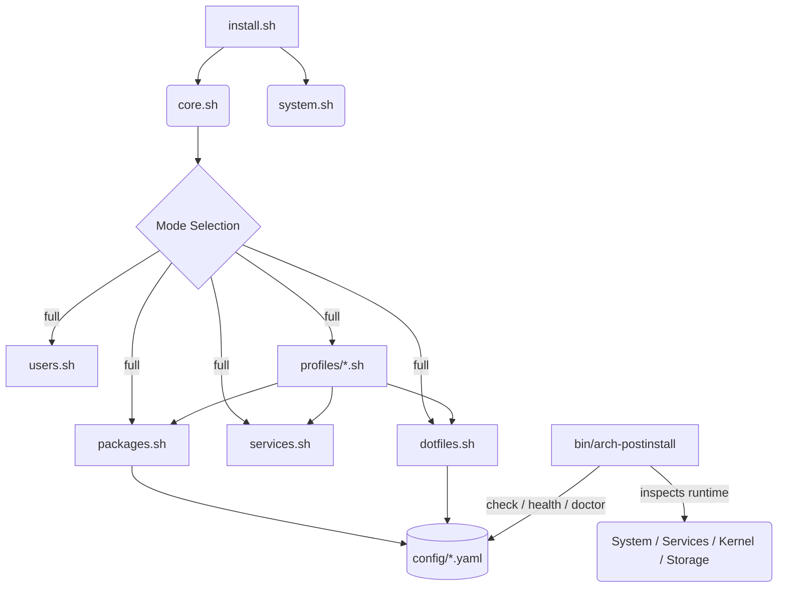

# Arch Linux Post-Installation Workbench

<div align="center">
  
  
</div>

A highly modular, automated, and visually polished Arch Linux post-installation framework. Transforms a fresh Arch install into a production-ready **Hyprland** workstation with curated aesthetics and a centralized theming engine.

<div align="center">

[](https://hyprland.org)
[](https://archlinux.org)
[](https://www.gnu.org/software/bash/)
[](https://neovim.io)
[](https://github.com/catppuccin/catppuccin)
[](https://opensource.org/licenses/MIT)

</div>

---

<a id="table-of-contents"></a>
## Table of Contents

- [Features](#features)
- [How it Works](#how-it-works)
- [Validation & System Health](#validation--system-health)
- [Requirements](#requirements)
- [Quick Start](#quick-start)
- [Usage](#usage)
- [File Structure](#file-structure)
- [Theming System](#theming-system)
- [Keybindings](#keybindings)
- [Included Stack](#included-stack)
- [Troubleshooting](#troubleshooting)
- [Customization](#customization)
- [Contributing](#contributing)
- [License](#license)
- [Credits](#credits)

---

## Features

| Feature | Description |
|:---:|:---|
| 🧱 | **Modular Design**: Packages, services, and dotfiles are decoupled into core modules and environment profiles. |
| 🛡️ | **Validation & System-Health Engine**: One command (`arch-postinstall check/health/doctor`) to verify configuration conformance and runtime system health. |
| 🩺 | **Diagnostic Doctor**: Translates warnings and failures into root-cause comparisons with copy-paste remediation commands. |
| 🧩 | **Plugin-based Profiles**: Easily add new desktop environments (e.g., GNOME, KDE) by dropping a script into `profiles/`. |
| 🎨 | **Unified Theming**: Dark (Macchiato) and Light (Latte) themes applied via `SUPER + N`. |
| 👤 | **Profile-Based**: Supports `full`, `base`, or `dotfiles` installation modes. |
| 🔄 | **Idempotent & Safe**: All validation commands are strictly read-only; installation re-runs use safe flags. |
| 📜 | **Structured Logging & JSON**: Human-readable colorized reports alongside machine-readable JSON (`--json`). |
| 🔗 | **Symlinked Dotfiles**: Automated deployment with automatic backups of existing configs. |

<p align="right">(<a href="#table-of-contents">back to top</a>)</p>

---

## How it Works

The workbench implements a complete lifecycle from initial setup to verified production readiness:

```
install ──> configure ──> validate (check) ──> health ──> diagnose (doctor) ──> optional fix
```



<p align="right">(<a href="#table-of-contents">back to top</a>)</p>

---

## Validation & System Health

The repository includes a post-installation validation, health, and diagnostics framework via `bin/arch-postinstall` or `make`.

### Commands

```bash
# 1. Configuration Conformance: Verify installed system matches config/base.yaml and profile YAML
./bin/arch-postinstall check

# 2. Runtime System Health: Check active daemons, failed units, storage, RAM, and network
./bin/arch-postinstall health

# 3. Diagnostic Doctor: Root-cause diagnosis with copy-paste fix commands
./bin/arch-postinstall doctor

# 4. Status Dashboard: Complete configuration + runtime health scorecard
./bin/arch-postinstall status

# 5. Output pure valid JSON for automation
./bin/arch-postinstall status --json
```

### Validation Categories

| Category | Scope | Key Probes |
|---|---|---|
| `base` | Core OS & Hardware ID | Arch Linux release, hostname, timezone, locale, CPU microcode, kernel |
| `boot` | Bootloader & ESP | UEFI/BIOS mode, ESP mount, systemd-boot/GRUB/Limine/rEFInd, vmlinuz/initramfs sync |
| `packages` | Package Conformance | Pacman DB lock, YAML package conformance, AUR packages, orphan packages, updates |
| `systemd` | System Daemons | System running state, failed units, declarative services, user audio units |
| `filesystem` | Storage & Mounts | Root `/`, `/boot`, `/home`, capacity % thresholds, inode limits, ro mounts, SMART |
| `network` | Networking | Interfaces, IPs, default route, DNS resolution, HTTP/ICMP reachability, net daemons |
| `time` | Time Sync | Timezone match, clock synchronization, NTP status, timesyncd/chrony |
| `security` | Access & Posture | Unprivileged user, wheel group, UID 0 accounts, SSH permissions, firewall status |
| `hardware` | System Resources | CPU topology, RAM/swap pressure, GPU controllers, PCIe/USB devices |
| `desktop` | Graphical Environment | Hyprland Lua configuration, Wayland session, XDG portals, desktop tools |
| `audio` | Sound Subsystem | PipeWire stack, wireplumber, user services, audio sinks |
| `bluetooth` | Wireless Controllers | Bluetooth hardware detection, bluez daemon, rfkill block status (clean skip if unconfigured) |
| `power` | Chassis & Power | Laptop detection, battery health, power profiles daemon, CPU thermal zones |
| `maintenance`| Housekeeping | Pending package updates, orphan hygiene, journal disk footprint, trim timers |

### Exit Codes

| Code | Status | Meaning |
|---|---|---|
| `0` | `PASS` | All checks passed or skipped |
| `1` | `WARN` | System has non-critical warnings |
| `2` | `FAIL` | One or more check failures detected |
| `3` | `USAGE`| Invalid CLI options or argument syntax |
| `4` | `DEP`  | Missing critical dependency |

<p align="right">(<a href="#table-of-contents">back to top</a>)</p>

---

## Requirements

- Arch Linux (fresh installation)
- Non-root user with `sudo` privileges
- Active internet connection
- Git installed (`pacman -S git`)

<p align="right">(<a href="#table-of-contents">back to top</a>)</p>

---

## Quick Start

```bash
git clone https://github.com/CozyRunner/arch-post-install.git
cd arch-post-install
chmod +x install.sh bin/arch-postinstall
./install.sh
```

<p align="right">(<a href="#table-of-contents">back to top</a>)</p>

---

## Usage

### Interactive Mode

```bash
./install.sh
```

### Modes

| Mode | Description |
|------|-------------|
| `full` | Base + Hyprland + dotfiles (default) |
| `base` | System essentials only (no DE) |
| `dotfiles` | Deploy configurations only |

### Makefile Shortcuts

```bash
make full                   # Full install (base + Hyprland + dotfiles)
make base                   # Base packages only
make dotfiles               # Deploy dotfiles
make check                  # Run post-installation configuration validation
make health                 # Run runtime system-health checks
make doctor                 # Run automated diagnostics & remediation suggestions
make fix                    # Interactively apply diagnostic remediation commands
make status                 # Run full system status scorecard
make zram                   # Configure ZRAM compressed swap
make btrfs                  # Configure Btrfs Snapper snapshots & snap-pac
make firewall               # Configure UFW firewall
make test                   # Execute automated test suite
make lint                   # Lint scripts with shellcheck
make help                   # Show all targets
```

<p align="right">(<a href="#table-of-contents">back to top</a>)</p>

---

## File Structure

```
arch-post-install/
├── bin/
│   └── arch-postinstall       # Unified CLI entry point (check, health, doctor, status, install)
├── lib/
│   ├── common.sh              # Shared utilities, YAML fallbacks, privilege checks
│   ├── output.sh              # Formatting, ANSI detection, category headers, scorecards
│   ├── checks.sh              # Assertions API, check registry, JSON serializer
│   └── doctor.sh              # Automated diagnosis & fix generator
├── scripts/
│   ├── check/                 # 14 validation & health check modules
│   │   ├── base.sh            # OS, hostname, timezone, locale, microcode, kernel
│   │   ├── boot.sh            # UEFI/BIOS mode, ESP partition, bootloader, initramfs sync
│   │   ├── packages.sh        # Pacman DB, YAML package conformance, orphans, updates
│   │   ├── systemd.sh         # System state, failed units, declarative services, user units
│   │   ├── filesystem.sh      # Mountpoints, disk capacity, inode, ro checks, SMART
│   │   ├── network.sh         # Interfaces, IP assignment, default gateway, DNS, connectivity
│   │   ├── time.sh            # Clock sync, timezone conformance, NTP daemons
│   │   ├── security.sh        # User accounts, wheel group, UID 0 accounts, SSH, firewall
│   │   ├── hardware.sh        # CPU topology, RAM & swap utilization, GPU controllers
│   │   ├── desktop.sh         # Hyprland config, Wayland session, portals, dotfiles
│   │   ├── audio.sh           # PipeWire stack, wireplumber, user audio units, sound sinks
│   │   ├── bluetooth.sh       # Controller detection, bluez daemon, rfkill block state
│   │   ├── power.sh           # Chassis detection, battery health, power profiles, thermals
│   │   └── maintenance.sh     # Updates, orphan hygiene, journal size, timers, mirrors
│   ├── install_yay.sh         # AUR helper setup
│   ├── setup_fish.sh          # Fish + Fisher + plugins
│   ├── setup_kwallet.sh       # PAM configuration for KWallet auto-unlock
│   ├── setup_waybar_media.sh  # Waybar media player integration
│   └── fonts.sh               # Font installation
├── config/
│   ├── base.yaml              # Core packages & system settings
│   ├── hyprland.yaml          # Hyprland packages, services & dotfiles
│   └── checks.conf            # Check thresholds, timeouts, and override rules
├── docs/
│   └── check-framework.md     # Developer guide for writing check modules
├── tests/
│   ├── test_runner.sh         # Master automated test harness
│   ├── test_framework.sh      # Framework and assertion unit tests
│   ├── test_cli.sh            # CLI interface and exit code tests
│   ├── test_json.sh           # JSON schema and ANSI compliance tests
│   └── test_categories.sh     # Mocked assertion category tests
├── modules/
│   ├── core.sh                # Engine: YAML parsing, logging, checks
│   ├── system.sh              # System-wide setup (pacman tuning, ZRAM, firewall, shell)
│   ├── btrfs.sh               # Automated Btrfs snapshot management with Snapper & snap-pac
│   ├── packages.sh            # Pacman & AUR package installation
│   ├── services.sh            # Systemd service management
│   ├── users.sh               # User configuration & locale
│   ├── flatpak.sh             # Flatpak runtime & app management
│   └── dotfiles.sh            # Symlink deployment with backup
├── profiles/
│   └── hyprland.sh            # Hyprland environment orchestrator (plugin)
├── dotfiles/                  # Wayland & desktop configuration directories
├── install.sh                 # Installation entry point
├── ARCHITECTURE.md            # Technical architecture documentation
├── Makefile                   # Development shortcuts & automation
└── logs/                      # Timestamped installation logs
```

<p align="right">(<a href="#table-of-contents">back to top</a>)</p>

---

## Theming System

The unified theme engine uses **Catppuccin** color palettes by default for a consistent, eye-pleasing experience, while supporting 7 curated dual-mode theme schemes:

- 🌑 **Dark Mode**: Catppuccin Macchiato / Mocha
- ☀️ **Light Mode**: Catppuccin Latte

### Theme Schemes

| Theme Scheme | Dark Variant | Light Variant | Vibe & Aesthetics |
|--------------|--------------|---------------|-------------------|
| **Catppuccin** | Catppuccin Mocha | Catppuccin Latte | Soothing pastel palette with high contrast and cozy aesthetic. |
| **Tokyo Night** | Tokyo Night Storm / Night | Tokyo Night Day | High-contrast neon blues, purples, and crisp whites. Modern synthwave aesthetic. |
| **Gruvbox** | Gruvbox Dark | Gruvbox Light | Retro, warm, earthy tones with distinctive yellows and oranges. Easy on the eyes. |
| **Everforest** | Everforest Dark | Everforest Light | Natural, muted greens and soft earthy background tones. Clean and organic. |
| **Nord** | Nord Dark | Nord Light / Snow | Cool, arctic ice blues and slate grays. Minimalist and clean. |
| **Rosé Pine** | Rosé Pine | Rosé Pine Dawn | Pastel, dreamy, soft pink and lavender tones. |
| **Default Dark/Light** | Dark Theme | Light Theme | Standard high-contrast dark and light system themes. |

Toggle dark/light mode instantly with **`SUPER + N`**, or open the interactive Theme Scheme Picker with **`SUPER + Shift + T`**. The system synchronizes the following components in real time:

1. **Hyprland** - Border gradients, active opacity, shadow colors, and layer blurs via `theme.lua`.
2. **Waybar** - CSS variables for background, text, borders, and accent colors.
3. **Kitty / Alacritty** - Terminal color schemes.
4. **Rofi** - Dynamic RASI variables for launchers and quick settings.
5. **GTK/Qt** - System-wide interface preferences (Dark/Light preference & Adwaita themes).
6. **Superfile / Zellij** - Terminal file manager and multiplexer palette synchronization.
7. **Wallpapers** - Coordinated dark and light desktop wallpapers via `hyprpaper`.

<p align="right">(<a href="#table-of-contents">back to top</a>)</p>

---

## Keybindings

### Core & Applications
| Keybinding | Action |
|------------|--------|
| `SUPER + Q` | Launch primary terminal (Kitty) |
| `SUPER + Return` | Launch secondary terminal (Alacritty) |
| `SUPER + Space` / `SUPER + R` | Application Launcher (Rofi) |
| `SUPER + E` | File Manager (Nautilus) |
| `SUPER + B` | Web Browser (Chromium) |
| `SUPER + I` / `SUPER + D` | Quick Settings Floating Menu |
| `SUPER + V` | Clipboard History Manager |
| `CTRL + SHIFT + Escape` | Task Manager (btop) |

### Window Management & Layout
| Keybinding | Action |
|------------|--------|
| `SUPER + C` / `ALT + F4` | Close / Kill Active Window |
| `SUPER + Shift + V` | Toggle Window Floating |
| `SUPER + F` | Toggle True Fullscreen |
| `SUPER + ALT + F` | Toggle Maximized Window |
| `SUPER + Up` / `SUPER + Down` | Maximize / Restore Window |
| `SUPER + T` | Pin Active Window |
| `SUPER + BackSpace` | Center Floating Window |
| `SUPER + P` | Pseudo Tile Layout |
| `SUPER + J` | Toggle Dwindle Split |
| `SUPER + Arrow Keys` | Move Focus (Left / Right / Up / Down) |
| `SUPER + Shift + Arrow Keys` | Move Active Window (Left / Right / Up / Down) |
| `ALT + Tab` / `SUPER + Tab` | Cycle Windows / Bring to Top |
| `SUPER + LMB (Drag)` | Drag & Move Window |
| `SUPER + RMB (Drag)` | Resize Window |

### Workspaces & Desktops
| Keybinding | Action |
|------------|--------|
| `SUPER + [1-9, 0]` | Switch to Workspace 1–10 |
| `SUPER + Shift + [1-9, 0]` | Move Active Window to Workspace 1–10 |
| `CTRL + SUPER + Left / Right` | Cycle Previous / Next Workspace |
| `CTRL + SUPER + D` | Switch to Empty Workspace |
| `SUPER + S` | Toggle Special Workspace (Scratchpad) |
| `SUPER + ALT + S` | Move Window to Special Workspace |
| `SUPER + Scroll Up / Down` | Switch Workspace via Mouse Wheel |

### System, Utilities & Screenshots
| Keybinding | Action |
|------------|--------|
| `SUPER + N` | Toggle Dark / Light Mode |
| `SUPER + Shift + T` | Open Theme Scheme Picker |
| `SUPER + L` | Lock Screen (hyprlock) |
| `SUPER + Escape` | Power Management Menu |
| `SUPER + Shift + Q` | Exit Hyprland Session |
| `SUPER + Shift + C` | Calendar & Tasks (Calcure TUI) |
| `SUPER + Shift + J` | Daily Journal & Notes (tui-journal) |
| `SUPER + F5` | Firmware Update Check |
| `Print` / `SUPER + Shift + S` | Snipping Tool Screenshot (Area & Clipboard) |
| `ALT + Print` | Screenshot Active Window |
| `SHIFT + Print` | Screenshot Current Monitor |
| `XF86AudioRaise / Lower` | Volume Control (wpctl) |
| `XF86AudioMute / MicMute` | Mute Output / Microphone |
| `XF86MonBrightnessUp / Down` | Display Brightness (brightnessctl) |

<p align="right">(<a href="#table-of-contents">back to top</a>)</p>

---

## Included Stack

| Category | Components |
|:---:|:---|
| **Compositor** | [Hyprland](https://hyprland.org) (Native Lua Engine), [hyprpaper](https://github.com/hyprwm/hyprpaper), [hypridle](https://github.com/hyprwm/hypridle), [hyprlock](https://github.com/hyprwm/hyprlock) |
| **Bar/UI** | [Waybar](https://github.com/Alexays/Waybar), [Dunst](https://dunst-project.org/) |
| **Launcher** | [Rofi](https://github.com/davatorium/rofi) (Custom Floating & Dmenu Themes) |
| **Terminal** | [Kitty](https://sw.kovidgoyal.net/kitty/), [Alacritty](https://alacritty.org/) |
| **File Manager** | [Nautilus](https://apps.gnome.org/Nautilus/), [Superfile](https://github.com/yorukot/superfile), [Yazi](https://github.com/sxyazi/yazi) |
| **Editor** | [Neovim](https://neovim.io) ([LazyVim](https://lazyvim.github.io) setup) |
| **Productivity** | [Calcure](https://github.com/anufrievroman/calcure) (Calendar & Tasks TUI), [TUI-Journal](https://github.com/AmmarAbouZor/tui-journal) (Terminal Journal & Notes TUI) |
| **Multiplexer** | [Zellij](https://zellij.dev/) |
| **Browser** | [Chromium](https://www.chromium.org/) |
| **Media** | [MPV](https://mpv.io/), [imv](https://github.com/epezent/imv), [feh](https://feh.finalrewind.org/), [Evince](https://wiki.gnome.org/Apps/Evince) |
| **Audio** | [PipeWire](https://pipewire.org/), [WirePlumber](https://pipewire.pages.freedesktop.org/wireplumber/) |
| **Network** | [NetworkManager](https://wiki.archlinux.org/title/NetworkManager), [iWD](https://iwd.wiki.kernel.org/) |
| **Security** | [KWallet](https://utils.kde.org/projects/kwalletmanager/), `pam_kwallet` |
| **Theming** | [Papirus Icons](https://github.com/PapirusDevelopmentTeam/papirus-icon-theme), [Adwaita](https://gnome.pages.gitlab.gnome.org/libadwaita/doc/), [Kvantum](https://github.com/tsujan/Kvantum) |

<p align="right">(<a href="#table-of-contents">back to top</a>)</p>

---

## Troubleshooting

### Sudo requires password every time

Add to `/etc/sudoers` (use `visudo`):
```
username ALL=(ALL) NOPASSWD: ALL
```

### Fonts look broken

```bash
make fonts
```

### Theme toggle not working

Ensure the toggle script is executable:
```bash
chmod +x ~/.config/hypr/scripts/toggle_theme.sh
```

### AUR packages fail to build

Install required build tools:
```bash
sudo pacman -S --needed base-devel
```

### Hyprland doesn't start

Check logs:
```bash
cat ~/.hyprland/hyprland.log
```

### Sound not working

```bash
pulseaudio --kill
systemctl --user restart pipewire pipewire-pulse wireplumber
```

<p align="right">(<a href="#table-of-contents">back to top</a>)</p>

---

## Customization

### Add custom packages

Edit `config/base.yaml` or `config/hyprland.yaml`. The workbench automatically skips already installed packages.

```yaml
packages:
  pacman:
    - firefox
    - vlc
  aur:
    - visual-studio-code-bin
    - spotify
```

### Add dotfiles

Place your configuration directory in `dotfiles/` and add it to `config/hyprland.yaml`. Existing directories in `~/.config/` will be backed up automatically.

```yaml
dotfiles:
  - my-cool-app-config
```

### Change default theme

The theme system is centralized. Edit `dotfiles/theme/config.conf` to switch between flavors:
```bash
THEME=macchiato   # Dark mode
# OR:
THEME=latte       # Light mode
```

### Advanced: Custom Profiles

The workbench supports a plugin-based architecture for desktop environments. To add a new profile (e.g., `gnome`):

1. Create `config/gnome.yaml` with required packages and dotfiles.
2. Create `profiles/gnome.sh` and define a `setup_gnome()` function.
3. Add `run_cmd setup_gnome` to the `full` case in `install.sh`.

<p align="right">(<a href="#table-of-contents">back to top</a>)</p>

---

## Contributing

Contributions are welcome! Please read our [CONTRIBUTING.md](CONTRIBUTING.md) and [CODE_OF_CONDUCT.md](CODE_OF_CONDUCT.md) for details on our code of conduct and the process for submitting pull requests.

<p align="right">(<a href="#table-of-contents">back to top</a>)</p>

---

## License

MIT License - see [LICENSE](LICENSE) for details.

<p align="right">(<a href="#table-of-contents">back to top</a>)</p>

---

## Credits

- [Hyprland](https://hyprland.org) - Dynamic tiling compositor
- [Catppuccin](https://github.com/catppuccin/catppuccin) - Color palettes
- [LazyVim](https://lazyvim.github.io) - Neovim configuration
- All open-source contributors

<p align="right">(<a href="#table-of-contents">back to top</a>)</p>
